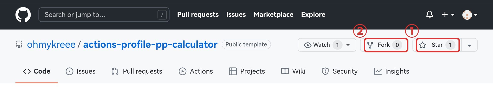
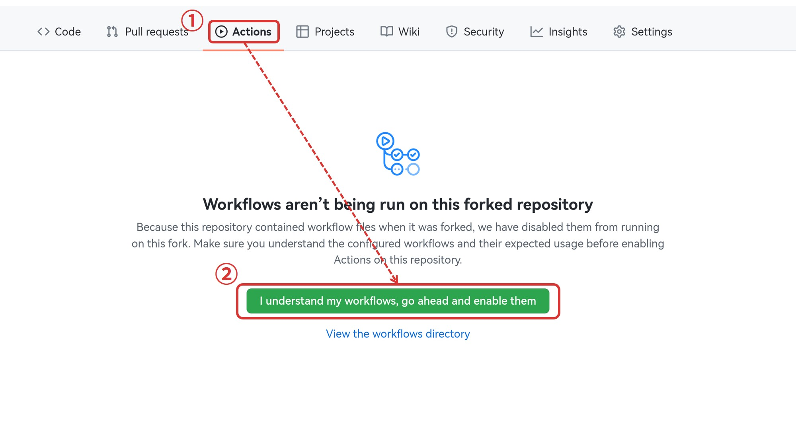
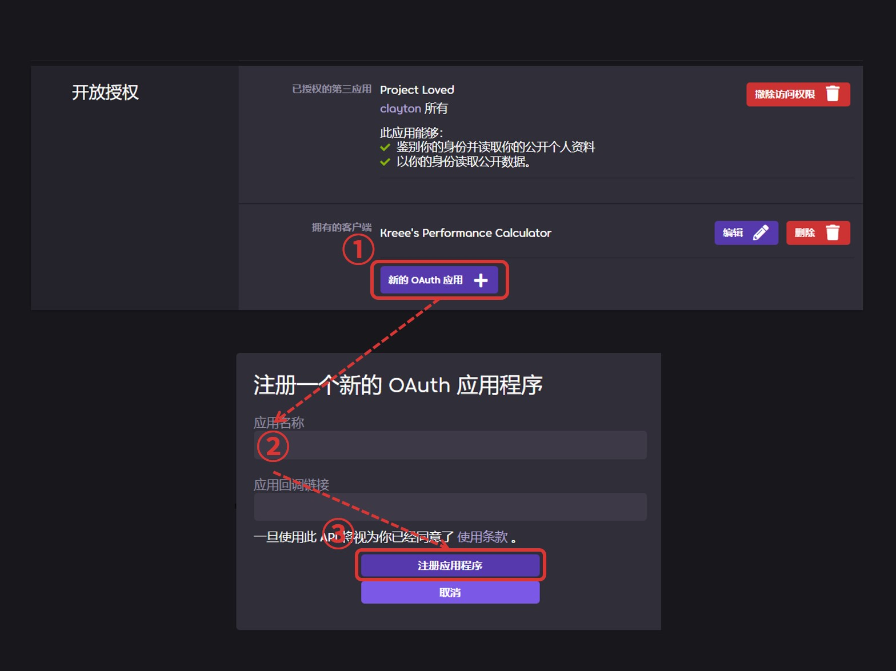
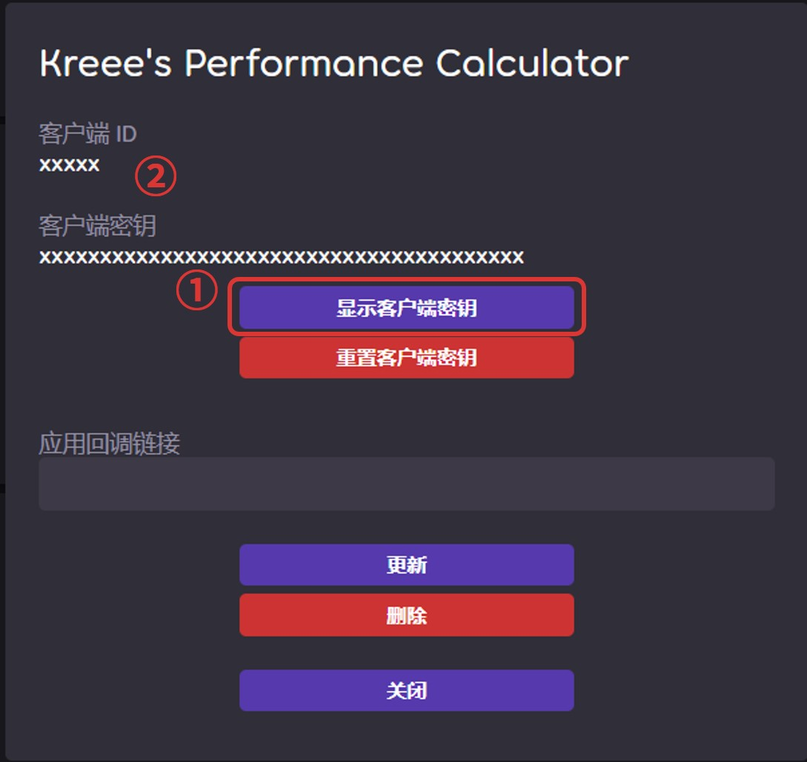
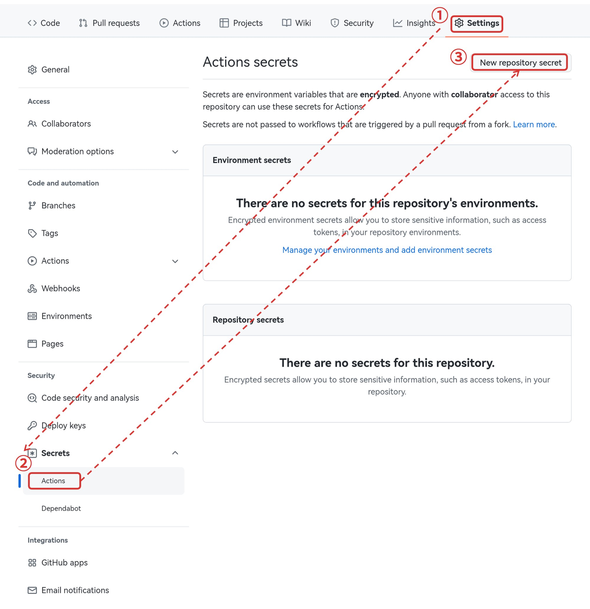
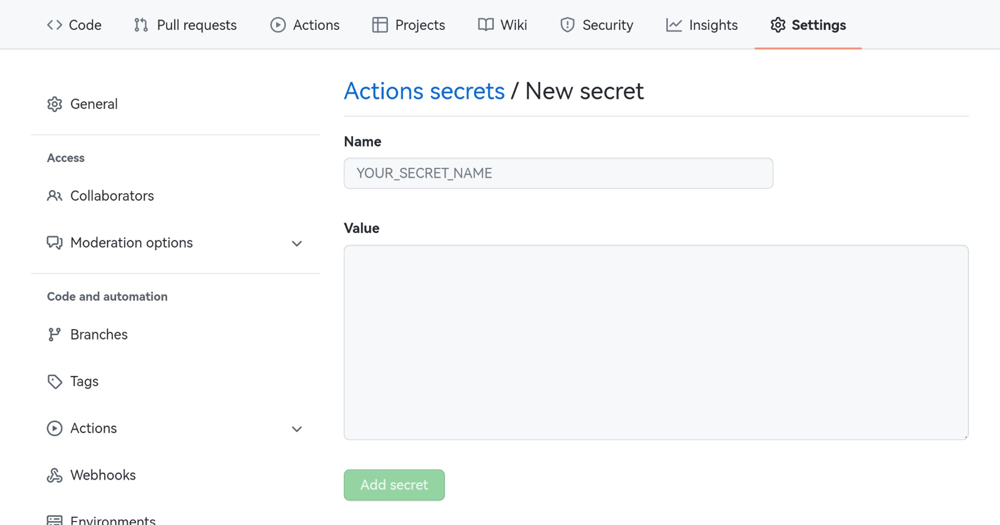
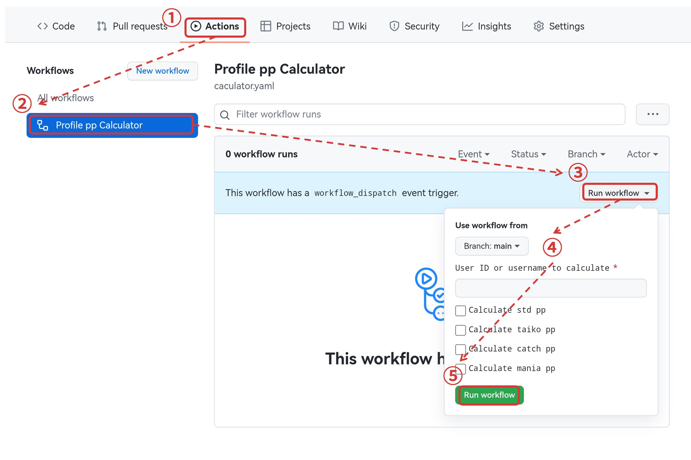
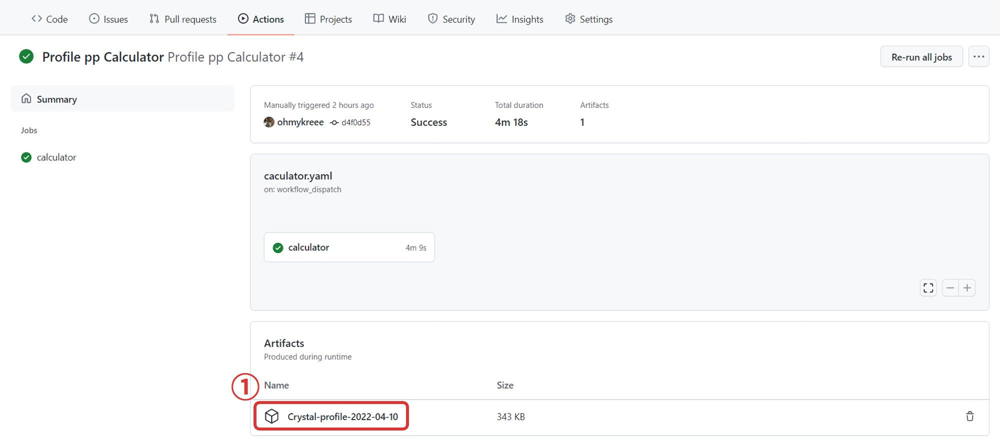

ZH | [EN](README_EN.md)
# 玩家 pp 计算器
测试状态：

# 使用步骤
## 0. 前提
- 一个 osu! 账号
- 一个 GitHub 账号

## 1. Fork 该仓库
Star（如果你想要支持以下我）并 Fork 该仓库。

**注意**：请将仓库设为 Public （公开），不支持私有仓库。

## 2. 启用GitHub actions
`Actions` --> `I understand my workflows, go ahead and enable them`

## 3. 创建 osu! OAuth 应用
前往 [osu! - 开放授权](https://osu.ppy.sh/home/account/edit#new-oauth-application) 创建一个新的 OAuth 应用：`开放授权` --> `新的 OAuth 应用` --> `填写应用名称` --> `注册应用程序`

点击 `显示客户端密钥`，记录客户端 ID 和 客户端密钥以备下一步使用。   
**注意**：请勿向任何人透露你的客户端 ID 和客户端密钥。如若泄露，请删除该客户端或重置客户端密钥。

## 4. 导入客户端 ID 和密钥
`Settings` --> `Secrets` --> `Actions` --> `New repository secret`

重复两次以上操作分别添加两个 `Secrets`：
| Name        | Value       |
| ----------- | ----------- |
| CLIENT_ID   | `客户端 ID`  |
| CLIENT_TOKEN| `客户端密钥` |

## 5. 运行 GitHub actions 并获取结果
`Actions` --> `Profile pp Calculator` --> `Run workflow` --> `填写玩家名和想要计算的模式` --> `Run workflow`

刷新页面，进入刚创建的任务，稍等片刻等待任务完成。完成后可在 `Artifacts` 区域下载结果。

# FAQ
1. 救命！我遇到问题了   
请在该仓库的 `Issues` 内选择 `New issue`：
- 请使用中文或者英文描述你的问题
- 请详细描述错误发生的经过，并提供运行日志
- 无关的问题或问题描述不详细并长期未回复的将进行关闭处理

2. 我想更新这个仓库   
`Code` --> `Fetch upstream` --> `Fetch and merge`