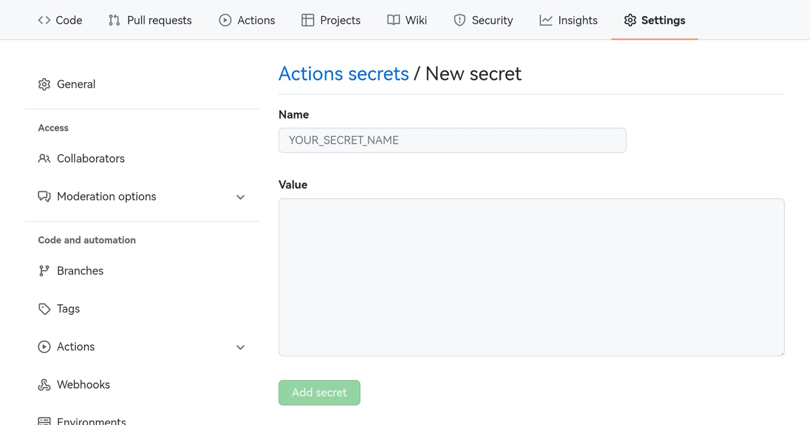
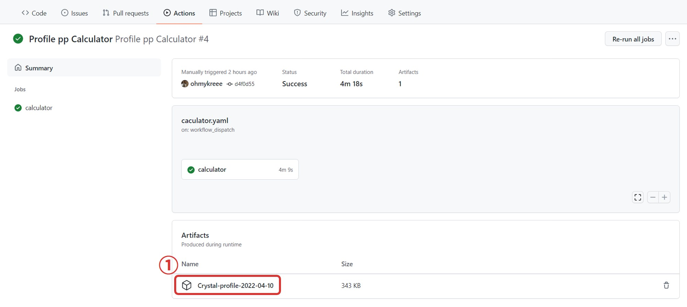

[ZH](README.md) | EN
# Player Profile pp Calculator
Test status：

# How to use
## 0. Precondition
- An osu! account
- A GitHub account

## 1. Fork this repository
Star (if you like) and fork this repository.

**Warning**: Please keep this repository PUBLIC, private repository is not supported.

## 2. Enable GitHub actions
`Actions` --> `I understand my workflows, go ahead and enable them`

## 3. Create osu! OAuth application
Head for [osu! - OAuth](https://osu.ppy.sh/home/account/edit#new-oauth-application) and create a new OAuth application: `OAuth` --> `New OAuth Application` --> `Fill in your application name` --> `Register Application`

Click `Show client secret` and take down your Client ID and Client Secret.      
**Warning**: DO NOT share these information with anybody else. If you accidentally leak your Client ID and Client Secret, please delete this client or choose Reset client secret.

## 4. Import your Client ID and Secret
`Settings` --> `Secrets` --> `Actions` --> `New repository secret`

Import these two `Secrets` by repeat the step above twice:
| Name        | Value       |
| ----------- | ----------- |
| CLIENT_ID   | `Client ID`  |
| CLIENT_TOKEN| `Client Secret` |

## 5. Trigger GitHub actions and get the result
`Actions` --> `Profile pp Calculator` --> `Run workflow` --> `Fill in the player name or ID` --> `Run workflow`

Refresh current page and enter the workflow you just created. Wait for the workflow finished, then you can download the zipped result file from `Artifacts` area.

# FAQ
1. Help! I encounter some problems.   
Please open a issue in the `Issues` page.
- Please use English or Chinese to describe your problem
- Please describe your problem in detail and attach the log file
- Issues not related to this project or issues with missing details and no further response will be closed

2. I want to update this repository   
`Code` --> `Fetch upstream` --> `Fetch and merge`